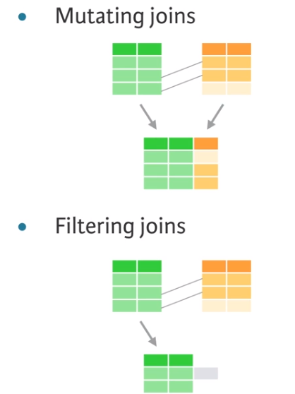
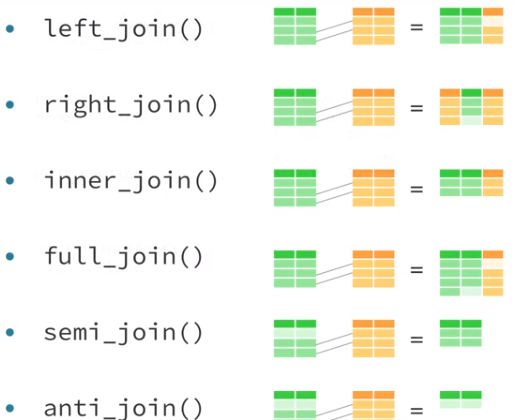
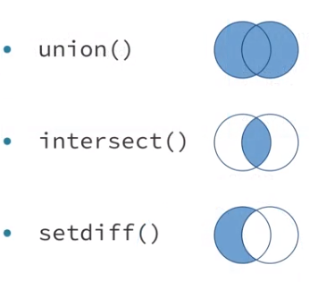
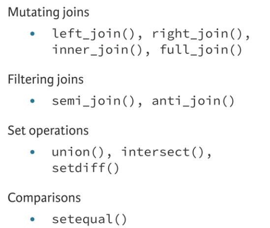

```{r setup, include=FALSE}
knitr::opts_chunk$set(eval=T, echo=T, cache=T, message=F, warning=F)
# Load the knitr and kableExtra packages
library(knitr)
library(kableExtra)
options(knitr.table.format = "html")
# Load the gapminder package
library(gapminder)
# Load the dpylr package
library(dplyr)
# Load the ggplot2 package as well
library(ggplot2)
theme_set(theme_bw())  # pre-set the bw theme.

# Load source datasets
source("create_datasets.R")
```


## Whats Covered

  - Mutating joins
  - **Filtering joins and set operations**
  - Assembling data
  - Advanced joining
  - Case Study
    
## Aditional Resources
  
  - [R for Data Science Book](http://r4ds.had.co.nz/)
  - [Data Wrangling Cheatsheet](https://www.rstudio.com/wp-content/uploads/2015/02/data-wrangling-cheatsheet.pdf)
  - [dplyr two table verbs vignette](https://cran.r-project.org/web/packages/dplyr/vignettes/two-table.html)
  - [dbplyr vignette](https://cran.r-project.org/web/packages/dbplyr/vignettes/dbplyr.html)
  

***  
# Filtering joins and set operations
***  

* Filtering joins return a copy of the dataset that has been filtered, not augmented (as with mutating joins)  
  <div style="width:500px">
    
  
## Semi-joins  

### Apply a semi-join  

As you saw, semi-joins provide a concise way to filter data from the first dataset based on information in a second dataset.  

For example, the code in the editor uses `semi_join()` to create a data frame of the artists in `artists` who have written a song in `songs`.  

```{r}
# View the output of semi_join()
new_artists <- 
  artists %>% 
  semi_join(songs, by = c("first", "last")) 

# Create the same result
new_artists <- 
  artists %>% 
  right_join(songs, by = c("first", "last")) %>% 
  filter(!is.na(instrument)) %>% 
  select(first, last, instrument) 

new_artists %>% 
  kable() %>%
  kable_styling(bootstrap_options = c("striped", "hover", "condensed", "responsive"), full_width = F, position = "left", font_size = 11) %>%
  row_spec(0, bold = T, color = "white", background = "#3f7689")
```

*You can see that a single semi-join is the equivalent of three separate operations.*  

###Exploring with semi-joins  

**Semi-joins** provide a useful way to explore the connections between multiple tables of data.  

For example, you can use a `semi-join` to determine the number of albums in the `albums` dataset that were made by a band in the `bands` dataset.  

```{r}
albums %>% 
  # Collect the albums made by a band
  semi_join(bands, by = c("band")) %>% 
  # Count the albums made by a band
  nrow() %>% 
  # Create pretty table
  kable() %>%
  kable_styling(bootstrap_options = c("striped", "hover", "condensed", "responsive"), full_width = F, position = "left", font_size = 11) %>%
  row_spec(0, bold = T, color = "white", background = "#3f7689")
```


### A more precise way to filter?  

  - You can use semi_joins with a df of date you want to match to easily filter  
  
```{r}
tracks
matches

# With semi-join
tracks %>% 
  semi_join(matches,by = c("band", "year", "first")) %>% 
  # Create pretty table
  kable() %>%
  kable_styling(bootstrap_options = c("striped", "hover", "condensed", "responsive"), full_width = F, position = "left", font_size = 11) %>%
  row_spec(0, bold = T, color = "white", background = "#3f7689")

# With dply filter statement
tracks %>% 
  filter(
    (band == "The Beatles" & year == 1964 & first == "Paul") |
    (band == "The Beatles" & year == 1965 & first == "John") |
    (band == "Simon and Garfunkel" & year == 1966 & first == "Paul")
  ) %>% 
  # Create pretty table
  kable() %>%
  kable_styling(bootstrap_options = c("striped", "hover", "condensed", "responsive"), full_width = F, position = "left", font_size = 11) %>%
  row_spec(0, bold = T, color = "white", background = "#3f7689")
```

*The filter does return the same observations as the semi-join, but it takes a bit of work to set things up properly, as you can see.*  


## Anti-joins  

* Full list of joins available; anti-join can be used to see which rows will not be matched to a second dataset by a join. 
  <div style="width:500px">
    
  
###Apply an anti-join 

Anti-joins provide a useful way to reason about how a mutating join will work before you apply the join.  

```{r}
# Return rows of artists that don't have bands info
artists %>% 
  anti_join(bands, by = c("first", "last")) %>% 
  # Create pretty table
  kable() %>%
  kable_styling(bootstrap_options = c("striped", "hover", "condensed", "responsive"), full_width = F, position = "left", font_size = 11) %>%
  row_spec(0, bold = T, color = "white", background = "#3f7689")
```

*Have you noticed that correct keys are as important to filtering joins as they were to mutating joins?*  

### Apply another anti-join  

Anti-joins with `anti_join()` also provide a great way to diagnose joins that go wrong.  

For example, they can help you zero-in on rows that have capitalization or spelling errors in the keys. These things will make your primary and secondary keys appear different to R, even though you know they refer to the same thing.  

```{r}
# Check whether album names in labels are mis-entered
labels %>% 
  anti_join(albums, by = c("album"))
```

*You can think of anti-join as a debugging tactic for joins. The next exercise will help you decide when to use `anti_join()` and when to use `semi_join()`.*  

###Which filtering join?  

Think you have filtering joins down? Let's check.

Which filtering join would you use to determine how many rows in `songs` match a label in `labels`?  

```{r}
# Determine which key joins labels and songs
labels %>% 
  # Create pretty table
  kable() %>%
  kable_styling(bootstrap_options = c("striped", "hover", "condensed", "responsive"), full_width = F, position = "left", font_size = 11) %>%
  row_spec(0, bold = T, color = "white", background = "#3f7689")

songs %>% 
  # Create pretty table
  kable() %>%
  kable_styling(bootstrap_options = c("striped", "hover", "condensed", "responsive"), full_width = F, position = "left", font_size = 11) %>%
  row_spec(0, bold = T, color = "white", background = "#3f7689")

# Check your understanding
songs %>% 
  # Find the rows of songs that match a row in labels
  semi_join(labels, by = c("album")) %>% 
  # Number of matches between labels and songs
  nrow() %>% 
  # Create pretty table
  kable() %>%
  kable_styling(bootstrap_options = c("striped", "hover", "condensed", "responsive"), full_width = F, position = "left", font_size = 11) %>%
  row_spec(0, bold = T, color = "white", background = "#3f7689")
```


## Set operations

  - `union` will return every row that appears in one or more of the datasets
    - If a row appears multiple times `union` will only return it once
  - `interesect` will return only the rows that appear in both datasets
  - `setdiff` will return the rows that appear in the first dataset but not the second
  
  <div style="width:300px; height=200px">
  
  </div>  


###How many songs are there?  

We have loaded two datasets in your workspace, `aerosmith` and `greatest_hits`, each of which represents an album from the band Aerosmith. Each row in either of the datasets is a song on that album.  

How many unique songs do these two albums contain in total?  

```{r}
aerosmith %>% 
  # Create the new dataset using a set operation
  union(greatest_hits) %>% 
  # Count the total number of songs
  nrow() %>% 
  # Create pretty table
  kable() %>%
  kable_styling(bootstrap_options = c("striped", "hover", "condensed", "responsive"), full_width = F, position = "left", font_size = 11) %>%
  row_spec(0, bold = T, color = "white", background = "#3f7689")
```

*The `union()` function provides an easy way to combine two datasets without duplicating any values.*  

###Greatest hits  

Which songs from Aerosmith made it onto Greatest Hits?  

```{r}
# Create the new dataset using a set operation
aerosmith %>% 
  intersect(greatest_hits) %>% 
  # Create pretty table
  kable() %>%
  kable_styling(bootstrap_options = c("striped", "hover", "condensed", "responsive"), full_width = F, position = "left", font_size = 11) %>%
  row_spec(0, bold = T, color = "white", background = "#3f7689")
```

*You can think of `intersect()` as the set operator equivalent of a `semi-join`. It is what you would use if your datasets contain the exact same variables.*  

###Live! Bootleg songs  

`live` contains the songs from a third Aerosmith album, Live! Bootleg.  

Which songs are on Live! Bootleg but not on Greatest Hits? Notice that the length of songs may be different when they are performed live.  

```{r}
# Select the song names from live
live_songs <- live %>% select(song)

# Select the song names from greatest_hits
greatest_songs <- greatest_hits %>% select(song)

# Create the new dataset using a set operation
live_songs %>% 
  setdiff(greatest_songs)  %>% 
  # Create pretty table
  kable() %>%
  kable_styling(bootstrap_options = c("striped", "hover", "condensed", "responsive"), full_width = F, position = "left", font_size = 11) %>%
  row_spec(0, bold = T, color = "white", background = "#3f7689")
```

###Multiple operations  

There is no set operation to find rows that appear in one data frame or another, but not both. However, you can accomplish this by combining set operators.  

Can you think of a combination that would answer the question, "Which songs appear on one of Live! Bootleg or Greatest Hits, but not both?"  

  - You'll need `setdiff()`, `intersect()`, and `union()`, but not necessarily in that order.  

```{r}
# Select songs from live and greatest_hits
live_songs <- live %>% select(song)
greatest_songs <- greatest_hits %>% select(song)

# Find songs in at least one of live_songs and greatest_songs
all_songs <- union(live_songs, greatest_songs)

# Find songs in both 
common_songs <- intersect(live_songs, greatest_songs)

# Find songs that only exist in one dataset
setdiff(all_songs, common_songs) %>% 
  # Create pretty table
  kable() %>%
  kable_styling(bootstrap_options = c("striped", "hover", "condensed", "responsive"), full_width = F, position = "left", font_size = 11) %>%
  row_spec(0, bold = T, color = "white", background = "#3f7689")
```

*Uncommonly good uncovering of uncommon songs! Working with set operators is fairly simple; it doesn't get much trickier than this. However, set operators do have one type of odd behavior, which you will learn about in the next exercise.*  

###Unique values  
`eagles1974` contains five rows, one for each member of the Eagles (a band) in 1974. Likewise, `eagles1971` contains four rows, one for each member of the band in 1971.  

Examine the contents of each dataset, then determine how many rows will be in the union of `eagles1974` with `eagles1971`. Does something surprising happen here?  

```{r eval = FALSE}
eagles1974

eagles1971

union(eagles1974, eagles1971)
```

How can a `union` return **fewer values** than are in the original dataset? The `union` **removes the duplicate row** for Don. The rows represent two different Dons, Don Felder and Don Henley, but there's nothing in eagles1974 to indicate this.  


## Comparing datasets

  - Its common to want to know if one data set is the same as another dataset
  - dplyr's `setequal` will do this easily
  - base R's `identical` is will only return true if the datasets have the exact same rows in the exact same order
  
Recap:

  <div style="width:300px; height=200px">
  
  </div> 
  

###Apply setequal  

`definitive` and `complete` contain the songs that appear in competing Led Zeppelin anthologies: *The Definitive Collection* and *The Complete Studio Recordings*, respectively.  

Both anthologies claim to contain the complete studio recordings of Led Zeppelin, but do the anthologies contain the same exact songs?  

```{r}
# Check if same order: definitive and complete
identical(definitive, complete)

# Check if any order: definitive and complete
setequal(definitive, complete)

# Songs in definitive but not complete
setdiff(definitive, complete)

# Songs in complete but not definitive
setdiff(complete, definitive)
```

The *Definitive Collection* contains the soundtrack for *The Song Remains the Same*, a documentary not featured in *The Complete Studio Recordings*.  

###Apply setequal again  

A few exercises ago, you saw that an `intersect()` is analagous to a `semi_join()` when two datasets contain the same variables and each variable is used in the key.  

Under these conditions, `setdiff()` is also analagous to one of the filtering joins.  

```{r}
# Return songs in definitive that are not in complete
definitive %>% 
  anti_join(complete, by = c("song", "album")) %>% 
  # Create pretty table
  head(10) %>%
  kable() %>%
  kable_styling(bootstrap_options = c("striped", "hover", "condensed", "responsive"), full_width = F, position = "left", font_size = 11) %>%
  row_spec(0, bold = T, color = "white", background = "#3f7689")

# Return songs in complete that are not in definitive
complete %>% 
  anti_join(definitive, by = c("song", "album")) %>% 
  # Create pretty table
  head(10) %>%
  kable() %>%
  kable_styling(bootstrap_options = c("striped", "hover", "condensed", "responsive"), full_width = F, position = "left", font_size = 11) %>%
  row_spec(0, bold = T, color = "white", background = "#3f7689")
```

*When your datasets contain the same variables, a `setdiff()` does the same thing as an `anti_join()` that uses every column as a key.*  

###Comparing albums  

It appears that *The Definitive Collection* contains songs from the soundtrack of *The Song Remains the Same*, a movie filmed during a live Led Zeppelin concert. Is this the only difference between *The Definitive Collection* and *The Complete Studio Recordings*?  

```{r}
nrow(complete)
nrow(definitive)

# Get union of complete and soundtrack
complete_and_soundtrack <- union(complete, soundtrack)

# Check if same, including order: definitive and union of complete and soundtrack
complete_and_soundtrack %>%
  identical(definitive)

# Check if same, rows in any order: definitive and union of complete and soundtrack
complete_and_soundtrack %>%
  setequal(definitive)
```


##Session info

```{r}
sessionInfo()
```