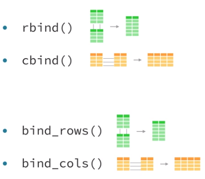
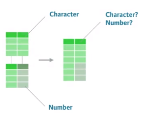

```{r setup, include=FALSE}
knitr::opts_chunk$set(eval=T, echo=T, cache=T, message=F, warning=F)
# Load the knitr and kableExtra packages
library(knitr)
library(kableExtra)
options(knitr.table.format = "html")
# Load the gapminder package
library(gapminder)
# Load the dpylr package
library(dplyr)
# Load the ggplot2 package as well
library(ggplot2)
theme_set(theme_bw())  # pre-set the bw theme.

# Load source datasets
source("create_datasets.R")
```


## Whats Covered

  - Mutating joins
  - Filtering joins and set operations
  - **Assembling data**
  - Advanced joining
  - Case Study
    
## Aditional Resources
  
  - [R for Data Science Book](http://r4ds.had.co.nz/)
  - [Data Wrangling Cheatsheet](https://www.rstudio.com/wp-content/uploads/2015/02/data-wrangling-cheatsheet.pdf)
  - [dplyr two table verbs vignette](https://cran.r-project.org/web/packages/dplyr/vignettes/two-table.html)
  - [dbplyr vignette](https://cran.r-project.org/web/packages/dbplyr/vignettes/dbplyr.html)
  

***  
# Assembling data
***  

## Binds

  - Base R binds
    - `rbind`, `cbind`
  - dplyr binds
    - `bind_rows`, `bind_cols`  
    
    
    

&nbsp;

  - Advantages of dplyr versions
    - faster
    - return a tibble (advanced data frame)
    - can handle lists of dataframes
    - `.id` argument in `bind_rows` allows you to pass in a name for each source dataframe
      - this will be added as a column to the result dataset
      - this is really handy when one of the variables for the data set is stored in the table name. 
      - e.g. houly weather data for different days
    - `rbind` will return an error if the column names do not match exactly. 
      - `bind_rows` will create a column for each unique column and distribute `NA`s appropriately


###Which bind?  

`side_one` and `side_two` contain tracks from sides one and two, respectively, of *Pink Floyd's* famous album *The Dark Side of the Moon*.  

Bind these datasets into a single table using a dplyr function. Which type of bind should you use?  

```{r}
# Examine side_one and side_two
side_one  %>% 
  # Create pretty table
  kable() %>%
  kable_styling(bootstrap_options = c("striped", "hover", "condensed", "responsive"), full_width = F, position = "left", font_size = 11) %>%
  row_spec(0, bold = T, color = "white", background = "#3f7689")

side_two  %>% 
  # Create pretty table
  kable() %>%
  kable_styling(bootstrap_options = c("striped", "hover", "condensed", "responsive"), full_width = F, position = "left", font_size = 11) %>%
  row_spec(0, bold = T, color = "white", background = "#3f7689")

# Bind side_one and side_two into a single dataset
side_one %>% 
  bind_rows(side_two) %>% 
  # Create pretty table
  kable() %>%
  kable_styling(bootstrap_options = c("striped", "hover", "condensed", "responsive"), full_width = F, position = "left", font_size = 11) %>%
  row_spec(0, bold = T, color = "white", background = "#3f7689")
```


###Bind rows
`discography` and `jimi` contain all of the information you need to create an anthology dataset for the band *The Jimi Hendrix Experience*.  

`discography` contains a data frame of each album by *The Jimi Hendrix Experience* and the year of the album.  

`jimi` contains a list of data frames of album tracks, one for each album released by *The Jimi Hendrix Experience*. As explained, you can pass bind_rows() a list of data frames like `jimi` to bind together into a single data frame.  

```{r}
# Examine discography and jimi
discography
jimi

jimi %>% 
  # Bind jimi by rows, with ID column "album"
  bind_rows(.id = c("album")) %>% 
  # Make a complete data frame
  left_join(discography, by = c("album")) %>% 
  # Create pretty table
  kable() %>%
  kable_styling(bootstrap_options = c("striped", "hover", "condensed", "responsive"), full_width = F, position = "left", font_size = 11) %>%
  row_spec(0, bold = T, color = "white", background = "#3f7689")
```

###Bind columns  

Let's make a compilation of *Hank Williams' 67 singles*. To do this, you can use `hank_years` and `hank_charts`:  

> `hank_years` contains the name and release year of each of Hank Williams' 67 singles.  
> `hank_charts` contains the name of each of Hank Williams' 67 singles as well as the highest position it earned on the Billboard sales charts.  

Each dataset contains the same songs, but `hank_years` is arranged chronologically by year, while `hank_charts` is arranged alphabetically by song title.  

```{r}
# Examine hank_years and hank_charts
hank_years %>% 
  # Create pretty table
  kable() %>%
  kable_styling(bootstrap_options = c("striped", "hover", "condensed", "responsive"), full_width = F, position = "left", font_size = 11) %>%
  row_spec(0, bold = T, color = "white", background = "#3f7689")

hank_charts %>% 
  # Create pretty table
  kable() %>%
  kable_styling(bootstrap_options = c("striped", "hover", "condensed", "responsive"), full_width = F, position = "left", font_size = 11) %>%
  row_spec(0, bold = T, color = "white", background = "#3f7689")

hank_years %>% 
  # Reorder hank_years alphabetically by song title
  arrange(song) %>% 
  # Select just the year column
  select(year) %>% 
  # Bind the year column
  bind_cols(hank_charts) %>% 
  # Arrange the finished dataset
  arrange(year, song) %>% 
  # Create pretty table
  kable() %>%
  kable_styling(bootstrap_options = c("striped", "hover", "condensed", "responsive"), full_width = F, position = "left", font_size = 11) %>%
  row_spec(0, bold = T, color = "white", background = "#3f7689")
```

### Danger

  - The biggest risk when using `bind_cols` is that the observations may not align acros the rows of your data frame  
  - Indeed, you will create meaningless data if you column bind two datasets whose rows do not align. Unfortunately, there is usually no clear way to tell whether or not the rows in two datasets align unless the datasets contain a mutual key. In that scenario, you can use a mutating join to bind the datasets in a foolproof way.  
  
  
  
## Build a better data frame

  - R Base way to create a dataframe
    - `data.frame()` and `as.data.frame()`
  - dplyr way to create a dataframe
    - `data_frame()` and `as_data_frame()`
  - Advantages of using `data_frame()`:
    - will never change the data type of a vector. (e.g. strings to factors)
    - will never add row names
    - will not changes unusual column names
    - only recycles length 1 inputs
    - evaluate lazily and in order. (So you can reference a column in the next column definition)
    - outputs a tibble (class tbl_df)
  - `as_data_frame` does all these same things
    - its just used on a list of columns

### Make a data frame  

Let's make a *Greatest Hits compilation* for Hank Williams. `hank_year`, `hank_song`, and `hank_peak` contain the columns of the data frame you made in the last exercise.  

```{r}
# Make combined data frame using data_frame()
data_frame(year = hank_year, song = hank_song, peak = hank_peak) %>% 
  # Extract songs where peak equals 1
  filter(peak == 1) %>% 
  # Create pretty table
  kable() %>%
  kable_styling(bootstrap_options = c("striped", "hover", "condensed", "responsive"), full_width = F, position = "left", font_size = 11) %>%
  row_spec(0, bold = T, color = "white", background = "#3f7689")
```


###Lists of columns  

As a data scientist, you should always be prepared to handle raw data that comes in many different formats.

`hank` saves Hank Williams' singles in a different way, as a `list` of `vectors`. Can you turn `hank` into the same dataset that you made in the last exercise?   

```{r}
# Examine the contents of hank
str(hank)

# Convert the hank list into a data frame
as_data_frame(hank) %>% 
  # Extract songs where peak equals 1
  filter(peak == 1) %>% 
  # Create pretty table
  kable() %>%
  kable_styling(bootstrap_options = c("striped", "hover", "condensed", "responsive"), full_width = F, position = "left", font_size = 11) %>%
  row_spec(0, bold = T, color = "white", background = "#3f7689")
```


###Lists of rows (data frames)  

`michael` contains a list of data frames, one for each album released by *Michael Jackson*. The code in the editor attempts to bind the data frames into a single data frame and then extract a data frame of the top tracks on each album.  

However, the code runs into a problem. The commented line fails because `as_data_frame()` combines a list of column vectors into a data frame. However, `michael` is a list of data frames.  

```{r}
# Examine the contents of michael
michael

# Replace the first line so each album has its own rows
bind_rows(michael, .id = c("album")) %>% 
  group_by(album) %>% 
  mutate(rank = min_rank(peak)) %>% 
  filter(rank == 1) %>% 
  select(-rank, -peak) %>% 
  # Create pretty table
  kable() %>%
  kable_styling(bootstrap_options = c("striped", "hover", "condensed", "responsive"), full_width = F, position = "left", font_size = 11) %>%
  row_spec(0, bold = T, color = "white", background = "#3f7689")
```


##Working with data types  

 Be aware of data types when combining vectors or data frames  
    - R will need to make a decision about the resulting type if the original types differ for a vector/column  
    
    
    <div style="width:300px; height=200px">
    
    </div>  
    
  - 6 atomic data types in R
    - logical
    - character
    - double
    - integer
    - complex
    - raw

```{r}
typeof(TRUE)
typeof("hello")
typeof(3.14)
typeof(1L)
typeof(1 + 2i)
typeof(raw(1))
```


### Atomic data types

  - R will coerce logicals and numerics to strings if strings are present
  - R will coerce logicals to numerics if numerics are present
  - as.character() will coerce factors to their labels as strings if strings are present
  - as.numeric() will coerce factors to their levels as numerics if numerics are present
  

## dplyr's coercion rules

Base R coercion rules:

  - in general the more specific type of data will convert to the more general
    - integer and logical will go to integer
    - double and integer/locgical will go to double
    - character and integer/double/logical will go to character
  - factors are tricky
    - if joining to an integer or double the factor integer values will be used
    - if joining to a character the factor labels will be used
    - be careful if you have numeric labels for your factors

dplyr's coercion rules:

  - dplyr functions will not automatically coerce data types
    - returns and error
    - expects you to manyally coerce data
  - Exception: factors
    - dplyr coverts non-aligning factors to strings
    - gives warning message
  
### dplyr and coercion

  - dplyr's two table functions will
    - coerce two factors to a string if the factors have different levels
    - coerce two factors to a string if the factors have the same levels in a different order
    - return an error instead of coercing logicals, integers, and numerics to a character

### Determining type

  - eighties has the year variable stores as a factor
  - sevnties has it stored as a character
  - when combined it will be a character
    - we will get a warning message
    
```{r, warning=T}
seventies %>% 
  # Create pretty table
  kable() %>%
  kable_styling(bootstrap_options = c("striped", "hover", "condensed", "responsive"), full_width = F, position = "left", font_size = 11) %>%
  row_spec(0, bold = T, color = "white", background = "#3f7689")

eighties %>% 
  # Create pretty table
  kable() %>%
  kable_styling(bootstrap_options = c("striped", "hover", "condensed", "responsive"), full_width = F, position = "left", font_size = 11) %>%
  row_spec(0, bold = T, color = "white", background = "#3f7689")

both <- seventies %>% bind_rows(eighties)

both %>% 
  # Create pretty table
  kable() %>%
  kable_styling(bootstrap_options = c("striped", "hover", "condensed", "responsive"), full_width = F, position = "left", font_size = 11) %>%
  row_spec(0, bold = T, color = "white", background = "#3f7689")
```

###Results

`sixties` contains the top selling albums in the US in the 1960s. It stores `year` as a **numeric** (double). When you combine it with seventies, which stores `year` as a **factor**, `bind_rows()` returns an error.  

You can fix this by coercing `seventies$year` to a **numeric**. But if you do it like this, something surprising happens.

```{r}
seventies %>% 
  mutate(year = as.numeric(year)) %>% 
  # Create pretty table
  kable() %>%
  kable_styling(bootstrap_options = c("striped", "hover", "condensed", "responsive"), full_width = F, position = "left", font_size = 11) %>%
  row_spec(0, bold = T, color = "white", background = "#3f7689")
```

Can you fix things?

```{r, error=T}
# sixties$year is a numeric and seventies$year is a factor
str(sixties)
str(seventies)

# This gives an error about not converting factor to numeric (i.e Column `year` can't be converted from factor to numeric)
#seventies %>% bind_rows(sixties)

# So lets convert it....
# But this converts the year to the integer factor value, not the year. Whoops
seventies %>% 
  mutate(year = as.numeric(year))

# We need to make it a character first to get the year, then convert to numeric
seventies %>% mutate(year = as.numeric(as.character(year)))
  
# Now we can join the datasets correctly
seventies %>% 
  # Coerce seventies$year into a useful numeric
  mutate(year = as.numeric(as.character(year))) %>% 
  # Bind the updated version of seventies to sixties
  bind_rows(sixties) %>% 
  arrange(year) %>% 
  # Create pretty table
  kable() %>%
  kable_styling(bootstrap_options = c("striped", "hover", "condensed", "responsive"), full_width = F, position = "left", font_size = 11) %>%
  row_spec(0, bold = T, color = "white", background = "#3f7689")
```

##Session info

```{r}
sessionInfo()
```