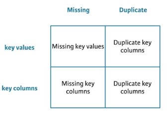
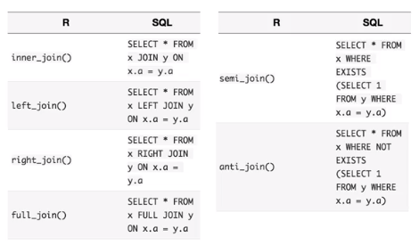
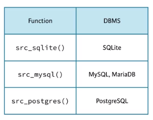

```{r setup, include=FALSE}
knitr::opts_chunk$set(eval=T, echo=T, cache=T, message=F, warning=F)
# Load the knitr and kableExtra packages
library(knitr)
library(kableExtra)
options(knitr.table.format = "html")
# Load the gapminder package
library(gapminder)
# Load the dpylr package
library(dplyr)
# Load the ggplot2 package as well
library(ggplot2)
theme_set(theme_bw())  # pre-set the bw theme.

# Load source datasets
source("create_datasets.R")
```


## Whats Covered

  - Mutating joins
  - Filtering joins and set operations
  - Assembling data
  - **Advanced joining**
  - Case Study
    
## Aditional Resources
  
  - [R for Data Science Book](http://r4ds.had.co.nz/)
  - [Data Wrangling Cheatsheet](https://www.rstudio.com/wp-content/uploads/2015/02/data-wrangling-cheatsheet.pdf)
  - [dplyr two table verbs vignette](https://cran.r-project.org/web/packages/dplyr/vignettes/two-table.html)
  - [dbplyr vignette](https://cran.r-project.org/web/packages/dbplyr/vignettes/dbplyr.html)
  

***  
# Advanced joining
***  

## What can go wrong?

  - This chapter is about becoming a master at joining data
  - The main problems with joins come from missing or duplicate key values or columns
  - NA in the key column?
    - Probably just need to remove these rows
  - Missing key column? 
    - it might be in the row name. use `rownames_to_column` in `tibble` package
  - duplicate keys?
    - Might just need to include another column in the key criteria
    - If you really have duplicates be careful as you will get every combination of key value matches across datasets.  
    

  <div style="width:500px">
  
  </div> 

### Spot the key

R's data frames can store important information in the `row.names` attribute. This is not a tidy way to store data, but it does happen quite commonly. If the primary key of your dataset is stored in `row.names`, you will have trouble joining it to other datasets.  

For example, `stage_songs` contains information about songs that appear in musicals. However, it stores the **primary key (song name)** in the `row.names` attribute. As a result, you cannot access the key with a join function.  

One way to remedy this problem is to use the function `rownames_to_column()` from the `tibble` package. `rownames_to_column()` returns a copy of a dataset with the row names added to the data as a column.  

```{r}
# Whoops, the primary key is in the row names for stage_songs
# We need to fix that before joining to stage_writers
stage_songs
stage_writers

# Load the tibble package
library(tibble)

stage_songs %>% 
  # Add row names as a column named song
  rownames_to_column("song") %>% 
  # Left join stage_writers to stage_songs
  left_join(stage_writers, by = c("song")) %>% 
  # Create pretty table
  kable() %>%
  kable_styling(bootstrap_options = c("striped", "hover", "condensed", "responsive"), full_width = F, position = "left", font_size = 11) %>%
  row_spec(0, bold = T, color = "white", background = "#3f7689")
```

*The tibble package contains many functions that began in dplyr and have since been moved to tibble*  


###Non-unique keys  

`shows` and `composers` provide some more information about songs that appear in musicals.  

You can join the two datasets by the musical column, which appears in both the datasets. However, you will run into a glitch: the values of musical do not uniquely identify the rows of composers. For example, two rows have the value *"The Sound of Music"* for musical and two other rows have the value *"The King and I"*.

How many entries (rows) will dplyr create for *The Sound of Music* if you left join `composers` to `shows` by musical?  

 - Non unique keys can be okay if you want the info for each entry and don't mind it being duplicated. 
    - like years will get duplicated here because there are non unique keys in the musical column of composers dataset  
    
```{r}
shows

# There are more than one composer for some musicals, so the musical column has duplicate key values. 
composers

# join by musical
shows %>% left_join(composers, by = "musical") %>% 
  # Create pretty table
  kable() %>%
  kable_styling(bootstrap_options = c("striped", "hover", "condensed", "responsive"), full_width = F, position = "left", font_size = 11) %>%
  row_spec(0, bold = T, color = "white", background = "#3f7689")
```

*If a row in the primary dataset contains multiple matches in the secondary dataset, left_join() will duplicate the row once for every match.*  

###Two non-unique keys  

You saw in the last exercise that if a row in the primary dataset contains multiple matches in the secondary dataset, `left_join()` will duplicate the row once for every match. This is true for all of dplyr's join functions.  

Now, let's see how this rule would apply when the *primary dataset contains duplicate key values*.

`show_songs` contains songs that appear in the musicals written by the composers. You can join the two by the `musical` column, but like `composers`, `show_songs` has two rows where `musical == "The Sound of Music"`.  

How many entries (rows) will exist for *The Sound of Music* if you left join `composers` to `show_songs` by `musical`?  

```{r}
show_songs

show_songs %>% 
  left_join(composers, by = "musical") %>%
  arrange(musical) %>% 
  head(12) %>% 
  # Create pretty table
  kable() %>%
  kable_styling(bootstrap_options = c("striped", "hover", "condensed", "responsive"), full_width = F, position = "left", font_size = 11) %>%
  row_spec(0, bold = T, color = "white", background = "#3f7689")
```

*This time `left_join()` duplicates each row in `show_songs` that contains the Sound of Music twice, once for each row of `composers` that contains the Sound of Music. The result is four rows that contain the Sound of Music.*  


###Missing keys  

*Julie Andrews* is a famous singer who performed in *The Sound of Music*, which is documented in the `singers` data frame. The `two_songs` data frame records a couple of songs that she sang during her career.  

Unfortunately, when you join the datasets together, something odd happens. According to the result, who sings *A Spoonful of Sugar*? Why does this happen?  

You can avoid this outcome by removing rows that contain `NAs` in the keys before joining.  

  - Missing keys can mistakenly join two rows that do not belong toegether
  
```{r}
singers
two_songs

# Examine the result of joining singers to two_songs
two_songs %>% inner_join(singers, by = "movie") %>% 
  # Create pretty table
  kable() %>%
  kable_styling(bootstrap_options = c("striped", "hover", "condensed", "responsive"), full_width = F, position = "left", font_size = 11) %>%
  row_spec(0, bold = T, color = "white", background = "#3f7689")

# Remove NA's from key before joining
two_songs %>% 
  filter(!is.na(movie)) %>% 
  inner_join(singers, by = "movie") %>% 
  # Create pretty table
  kable() %>%
  kable_styling(bootstrap_options = c("striped", "hover", "condensed", "responsive"), full_width = F, position = "left", font_size = 11) %>%
  row_spec(0, bold = T, color = "white", background = "#3f7689")
```

*This is the type of detail that dplyr is likely to handle itself in the future.*  


##Defining the keys  

  - If you do not set a `by` argument dplyr will join on all columns that match across the two datasets
  - You can use named vetors to match column with different names `by = c("name1"" = "name2")`
  - If there are non-key columns with the same names they wil show up as `name.x` and `name.y`
    - You can change this by adding the `suffix` argument. `suffix = c("name1","name2")`


###Which keys?  

*Frank Sinatra* and *Bing Crosby* each crossed the boundary from music to acting, singing famous songs in well-known movies. `movie_years` and `movie_songs` describe some of their work.  
Examine `movie_years` and `movie_songs` to determine which **keys** dplyr would use to join the datasets if you did not set the `by` argument. In this case, it would not matter which type of join you use, or in which order you call the datasets.  

```{r, message=T, warning=T}
movie_years

movie_songs

movie_years %>% 
  # Inner join movie_years to movie_songs
  inner_join(movie_songs) %>% 
  # Create pretty table
  kable() %>%
  kable_styling(bootstrap_options = c("striped", "hover", "condensed", "responsive"), full_width = F, position = "left", font_size = 11) %>%
  row_spec(0, bold = T, color = "white", background = "#3f7689")
```

*By default, dplyr will join by the combination of all column names that appear in both datasets.*  


###A subset of keys  

Often the same column name will be used by two datasets to refer to different things. For example, the data frame `movie_studios` uses name to refer to the name of a movie studio. `movie_years` uses name to refer to the name of an actor.

You could join these datasets (they describe the same movies), but you wouldn't want to use the name column to do so!  

`dplyr` will **ignore duplicate column names** if you set the `by` argument and do not include the duplicated name in the argument. When you do this, dplyr will treat the columns in the normal fashion, but it will add `.x` and `.y` to the duplicated names to help you tell the columns apart.  

```{r}
movie_years %>% 
  # Left join movie_studios to movie_years
  left_join(movie_studios, by = c("movie")) %>% 
  # Rename the columns: artist and studio
  rename(artist = name.x, studio = name.y) %>% 
  # Create pretty table
  kable() %>%
  kable_styling(bootstrap_options = c("striped", "hover", "condensed", "responsive"), full_width = F, position = "left", font_size = 11) %>%
  row_spec(0, bold = T, color = "white", background = "#3f7689")
```


###Mis-matched key names  

Just as the same name can refer to different things in different datasets, different names can refer to the same thing. For example, `elvis_movies` and `elvis_songs` both describe movies starring *Elvis Presley*, but each uses a different column name to describe the name of the movie.  

This type of inconsistency can be frustrating when you wish to join data based on the inconsistently named variable.  

To make the join, set `by` to a named vector. The names of the vector will refer to column names in the primary dataset (x). The values of the vector will correspond to the column names in the secondary dataset (y), e.g.

> x %>% left_join(y, by = c("x.name1" = "y.name2"))  

dplyr will make the join and retain the names in the primary dataset.

```{r}
# Identify the key column
elvis_songs
elvis_movies

elvis_movies %>% 
  # Left join elvis_songs to elvis_movies by this column
  left_join(elvis_songs, by = c("name" = "movie")) %>% 
  # Rename columns
  rename(movie = name, song = name.y) %>% 
  # Create pretty table
  kable() %>%
  kable_styling(bootstrap_options = c("striped", "hover", "condensed", "responsive"), full_width = F, position = "left", font_size = 11) %>%
  row_spec(0, bold = T, color = "white", background = "#3f7689")
```


###More mismatched names  

`movie_years` and `movie_directors` both describe movies that feature *Frank Sinatra* and *Bing Crosby*. However, each data frame uses different column names to refer to the key variables that connect the datasets.  

Can you join the data?

```{r}
# Identify the key columns
movie_directors
movie_years

movie_years %>% 
  # Left join movie_directors to movie_years
  left_join(movie_directors, by = c("movie" = "name")) %>% 
  # Arrange the columns using select()
  select(year, movie, artist = name, director, studio) %>% 
  # Create pretty table
  kable() %>%
  kable_styling(bootstrap_options = c("striped", "hover", "condensed", "responsive"), full_width = F, position = "left", font_size = 11) %>%
  row_spec(0, bold = T, color = "white", background = "#3f7689")
```


##Joining multiple tables  

  - To join multiple tables we could do a bunch of `left_join`s in a row
  - The `purrr` package has a function `reduce()` that lets us apply a function recursively to a list of datasets
  - `purrr` is also written by hadley wickham so it will work well with `dplyr` functions
  - the purpose of `purrr` is to help us apply R functions to data in efficient ways
  
### Join multiple tables

  - Using reduce to do a left_join quick of all tables
  
`purrr`'s `reduce()` function is very useful for joining together multiple datasets. Let's practice using it with three new datasets.  

supergroups lists the members of several "supergroup" bands, which are bands made from the members of other famous bands. more_bands lists the original band membership of many musicians, including those in supergroups. And more_artists lists the instruments that various artists played.

Can you join these datasets into a single, coherent dataset?

```{r}
# Load the purrr library
library(purrr)

# Place supergroups, more_bands, and more_artists into a list
list(supergroups, more_bands, more_artists) %>% 
  # Use reduce to join together the contents of the list
  reduce(left_join, by = c("first", "last")) %>% 
  # Create pretty table
  kable() %>%
  kable_styling(bootstrap_options = c("striped", "hover", "condensed", "responsive"), full_width = F, position = "left", font_size = 11) %>%
  row_spec(0, bold = T, color = "white", background = "#3f7689")
```


###Filter multiple tables  

Nice work! The job of `reduce()` is to apply a function in an iterative fashion to many datasets. As a result, `reduce()` works well with all of the dplyr join functions.

For example, you can use `reduce()` to filter observations with a filtering join. 

```{r}
list(more_artists, more_bands, supergroups) %>% 
  # Return rows of more_artists in all three datasets
  reduce(semi_join, by = c("first", "last")) %>% 
  # Create pretty table
  kable() %>%
  kable_styling(bootstrap_options = c("striped", "hover", "condensed", "responsive"), full_width = F, position = "left", font_size = 11) %>%
  row_spec(0, bold = T, color = "white", background = "#3f7689")
```

*The reduce idiom is a powerful tool and well worth knowing. In fact, it is a major component of 'MapReduce' in the Hadoop world.*  


##Other implementations  

  - We can do the same joins as we have been using here wih the `merge` function, but the syntax is more confusing
    - I will always just use `dplyr` joins
  - The `dplyr` joins translate to sql joins as show
    - These are good to know as often I am exploring a sql database before pulling data into R. It happens. 
      <div style="width:500px">
      
      </div> 
  - These are the DBMSs (Database management systems) you can easily connect to from R
    - Once you have connected you can write `dplyr` code and it will be translated to sql and run in the DBMS
    - This is incredible useful. Its worthy of its own corse. 
    - checkout [`vignette("dbplyr")`](https://cran.r-project.org/web/packages/dbplyr/vignettes/dbplyr.html) to see more about `dplyr`'s database capabilities
    - We can use `collect` to pull the data into R when we are ready or `data.frame` will also pull it in. 
      <div style="width:500px">
      
      </div>
    
### SQL

  - Each `dplyr` join has an SQL equivalent, and when you apply a dplyr join to a SQL data source (instead of a data frame), `dplyr` automatically converts your join to its SQL equivalent and runs it in the database.

### Base R

`dplyr joins` are also similar to the `merge()` function in base R.  

For example, the code in the editor uses `merge()` and `arrange()` to perform a `left_join()` on `bands` and `artists`.  

```{r}
# Alter the code to perform the join with a dplyr function
merge(bands, artists, by = c("first", "last"), all.x = TRUE) %>%
  arrange(band) 
  
bands %>% left_join(artists, by = c("first", "last"))
```


##Session info

```{r}
sessionInfo()
```